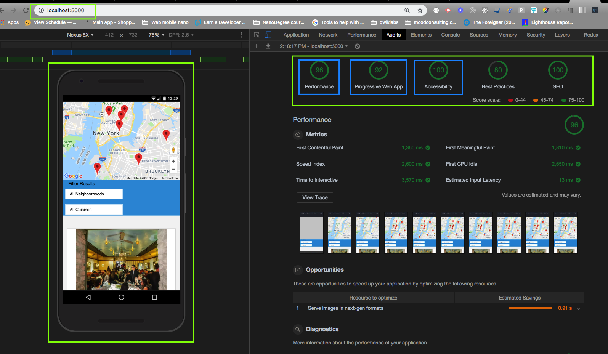
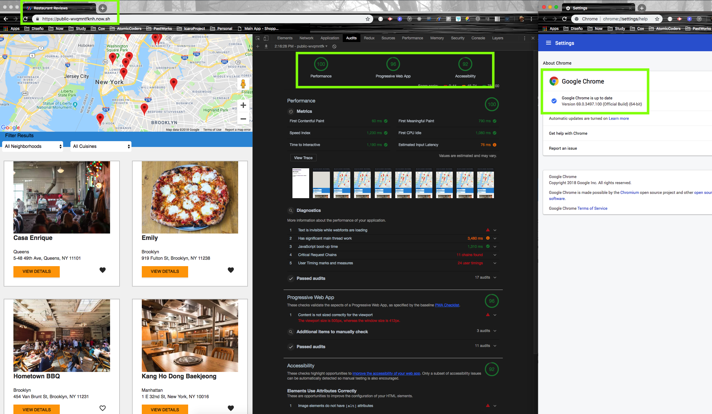

# Mobile Web Specialist - Udacity Certification Course

---

> _Three Stage Course Material Project - Restaurant Reviews_

## Project Overview: Stage 1 and Stage 2

### Stage 1

For the **Restaurant Reviews** projects, you will incrementally convert a static webpage to a mobile-ready web application. In **Stage One**, you will take a static design that lacks accessibility and convert the design to be responsive on different sized displays and accessible for screen reader use. You will also add a service worker to begin the process of creating a seamless offline experience for your users.

#### Project Overview

For the Restaurant Reviews projects, you will incrementally convert a static webpage to a mobile-ready web application. In Stage One, you will take a static design that lacks accessibility and convert the design to be responsive on different sized displays and accessible for screen reader use. You will also begin converting this to a Progressive Web Application by caching some assets for offline use.

#### Specification

You have been provided the code for a restaurant reviews website. The code has a lot of issues. It’s barely usable on a desktop browser, much less a mobile device. It also doesn’t include any standard accessibility features, and it doesn’t work offline at all. Your job is to update the code to resolve these issues while still maintaining the included functionality.

> In this real world case study, given the front end code for a static Restaurant Reviews App, revise the site to be responsive and achieve accessibility standards.

### Stage 2

In **Stage two**, the client application should pull restaurant data from the development server, parse the JSON response, and use the information to render the appropriate sections of the application UI.

The client application works offline. JSON responses are cached using the IndexedDB API. Any data previously accessed while connected is reachable while offline.

#### Performance Specifications

Lighthouse targets for each category exceed:

- Progressive Web App: >90
- Performance: >70
- Accessibility: >90

#### Requirements

Make the provided site fully responsive. All of the page elements should be usable and visible in any viewport, including desktop, tablet, and mobile displays. Images shouldn't overlap, and page elements should wrap when the viewport is too small to display them side by side.

Make the site accessible. Using what you've learned about web accessibility, ensure that alt attributes are present and descriptive for images. Add screen-reader-only attributes when appropriate to add useful supplementary text. Use semantic markup where possible, and aria attributes when semantic markup is not feasible.

Cache the static site for offline use. Using Cache API and a ServiceWorker, cache the data for the website so that any page (including images) that has been visited is accessible offline.

#### Acceptance criteria
Project specifications:

* [Stage 1](https://review.udacity.com/#!/rubrics/1090/view)
* [Stage 2](https://review.udacity.com/#!/rubrics/1131/view)

#### Stage 2 Performance Results

* [Audit file](audits/lighthouse-chromioum-audit-08082018.json)

* Audit screenshoot

### Stage 3

In **Stage three** add a form to allow users to create their own reviews: In previous versions of the application, users could only read reviews from the database. You will need to add a form that adds new reviews to the database. The form should include the user’s name, the restaurant id, the user’s rating, and whatever comments they have. Submitting the form should update the server when the user is online.

Add functionality to defer updates until the user is connected: If the user is not online, the app should notify the user that they are not connected, and save the users' data to submit automatically when re-connected. In this case, the review should be deferred and sent to the server when connection is re-established (but the review should still be visible locally even before it gets to the server.)

#### Performance Specifications

Lighthouse targets for each category exceed:

- Progressive Web App: >90
- Performance: >90
- Accessibility: >90

#### Requirements

Users are able to mark a restaurant as a favorite, this toggle is visible in the application. A form is added to allow users to add their own reviews for a restaurant. Form submission works properly and adds a new review to the database.

The client application works offline. JSON responses are cached using the IndexedDB API. Any data previously accessed while connected is reachable while offline. User is able to add a review to a restaurant while offline and the review is sent to the server when connectivity is re-established.

#### Acceptance criteria
Project specifications:

* [Stage 3](https://review.udacity.com/#!/rubrics/1132/view)

#### Stage 3 Performance Results

> The Performance Specifications Audit was performed using Google Chrome Version 69.0.3497.100

> **Audits configurations options**: Device: Mobile, Throttling: Simulated Fast 3G, 4x CPU Slowdown, Clear storage option unchecked.

>**Important to know:** While performing audit _**should not be enable**_ the _'Disable cache'_ option in the **Network panel** nor the _'Update on Reload'_ and _'Bypass for network'_ options on the **Application** panel **Service Workers** tab.

* [Audit file](audits/lighthouse-chromioum-audit-10132018.json)

* Audit screenshoot

#### How to check Lighthouse Performance Results

To have a best performance web server I published online the frontend version of this POC.

Use the below url the run the Audit:
* https://public-wvqmntfknh.now.sh/

> **Disclaimer:** The only intent of this is to allow to perform the PWA checks of the home page (`index.html`, the detail view is out of scope for this scenario. To check the complete offline work run the web app locally)

> **Requirement**: The backend server should be running locally. Check the "*How to run the web app*" section.

## Project URL on Github

https://github.com/rproenza86/mws-restaurant-stage-1

## Style guide

http://udacity.github.io/frontend-nanodegree-styleguide/index.html

## How to run the web app
* Start client server:

    `$ npm start`

* Start backend server:

    `$ cd server-stage-3/`

    `$ npm start`