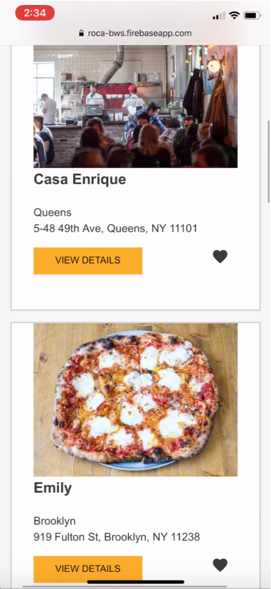

# Restaurants Reviews - Progressive Web App POC
---

> _Mobile Web Specialist - Udacity Certification Course_

## Online demo
https://roca-bws.firebaseapp.com/

## Video recorded demo

## Webapp technical requirements

* Offline support: Cache the static assets and webapp data
* Image optimization
* Responsive design
* Accessibility features : Accessible for screen reader use
* Performance metrics:
    - Progressive Web App: >90
    - Performance: >90
    - Accessibility: >90
* Backend server
* Frontend hosting with ssl support
* Database
* Cached JSON responses using the IndexedDB API
* Material design component for new UI elements design
* Functionality to defer updates until the user is connected when offline

## Webapp non-technical requirements

* Accessible for screen reader use
* The client application works offline
* The web app must to usable on any kind of device viewport, including desktop, tablet, and mobile displays
* Use data stored on database
* Server to provide and data store on the database
* Any data previously accessed while connected is reachable while offline
* Resilient handling of actions on offline mode
* Allow user to mark favorites restaurants
* Allow user to create restaurants' reviews

## Technologies and services used

* ES6
* Typescript
* Firebase
    - Hosting
    - Firestore(no-sql db)
    - Functions(serverless nodejs server)
* Material Design Web Components
* Grunt
* Docker
* Azure
    > Try the app on working in a container on Azure : http://restaurantsreviews.centralus.azurecontainer.io
    - Container group
    - Web application - container base

##  Performance Results

> The Performance Specifications Audit was performed using Google Chrome Version 69.0.3497.100

> **Audits configurations options**: Device: Mobile, Throttling: Simulated Fast 3G, 4x CPU Slowdown, Clear storage option unchecked.

>**Important to know:** While performing audit _**should not be enable**_ the _'Disable cache'_ option in the **Network panel** nor the _'Update on Reload'_ and _'Bypass for network'_ options on the **Application** panel **Service Workers** tab.

* [Audit file](audits/lighthouse-chromioum-audit-10132018.json)

* Audit screenshoot

## How to run the webapp locally
* Start client and backend servers:

    `$ npm start`